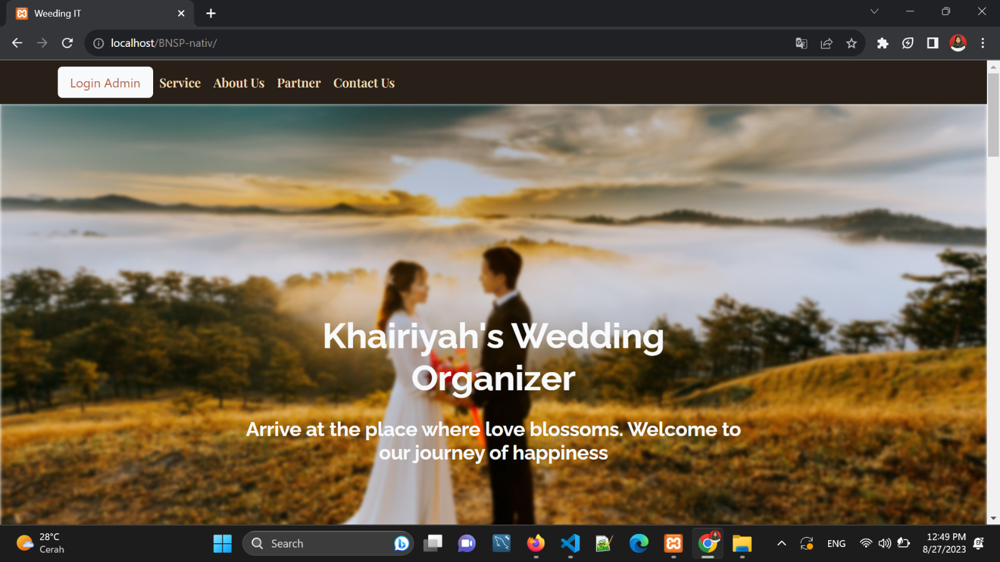

# Khairiyah's Wedding Organizer Project

Welcome to the **Khairiyah's Wedding Organizer** project repository. This repository contains a PHP native project that serves as a wedding organizer system. Feel free to clone and explore the project for your reference or use.

## Features

- **Client Management:** Manage client information, contacts, and preferences.
- **Event Planning:** Plan and organize wedding events with details and schedules.
- **Budget Management:** Keep track of budget allocations and expenses for events.
- **Gallery:** Showcase photos and videos from past events.
- **Customizable Views:** Easily customize the appearance of the application's user interface.

## Frontend Landing Page

**banner**

**Budget Management:**
**Gallery**
**Client Management:**
**Contact Us:**

## Frontend Dashboard Admin

**Client Management:**
**insert and edit Management:**
**Customizable Views:**
**insert and edit Customizable Views:**
**Client Gallery:**
**insert and edit Gallery:**

## Getting Started

To get started with the project, follow these steps:

1. Clone the repository to your local machine:

   ```bash
   git clone https://github.com/your-username/khairiyah-wedding-organizer.git
   ```
